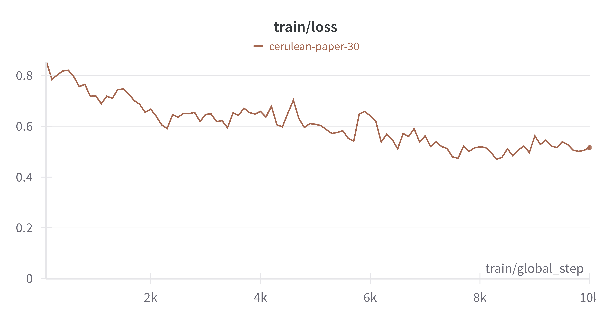
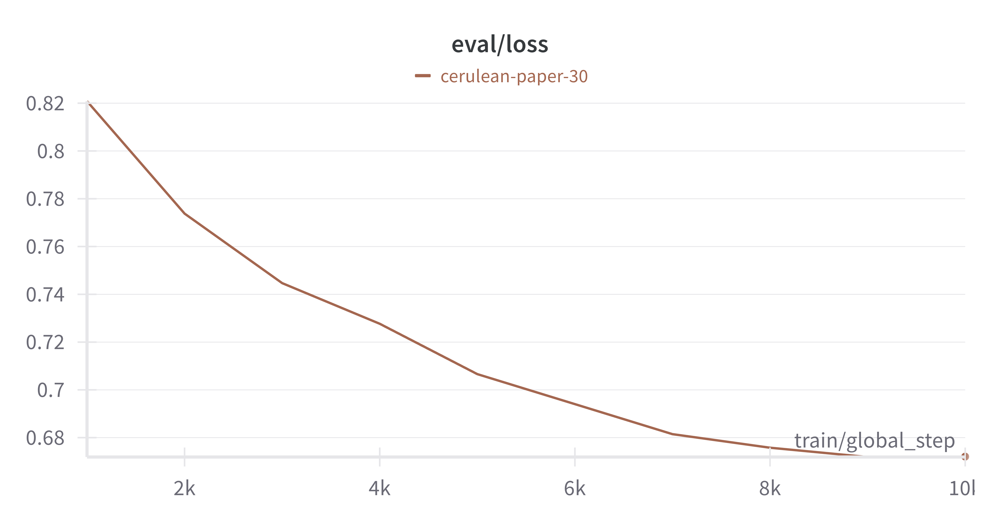

# Fine tuned Phi 3 for kotlin line completion

For this task I decided to utilize the recently released Phi 3. 
I fine-tuned the small language model Phi 3 to enhance its capabilities in Kotlin line completion, despite its primary training on Python code.

## Prerequisites

Ensure Python and all necessary CUDA tools are installed on your system. 
To install all required dependencies, run:

```bash
pip install -r requirements.txt
```
login to huggingface:
```bash
huggingface-cli login
```

## dataset parser

I sourced Kotlin repositories from the top 100 most starred that were active over the last month. 
Note: The Kotlin source code repository was excluded due to data inconsistencies.
```bash
cd dataset_parser
./parse_data.sh
```

## Fine tuning

To fine tune you can edit the run_peft.sh script inside the fine_tuning folder to perform the fine-tuning process.
```bash
./fine_tuning/run_peft.sh
```
The fine tuning process was done on an RTX 4090 and 10.000 data points. 
The training objective is fill in the middle.
I use QLoRA and PEFT to speed up the process and keep the costs down.



## Analysis

To get the kotlin line completion results:
```bash
python analysis/generate_kotlin_line_completion.py <model id> <fine tuned model id>
```
To get the python method completion results:
```bash
python analysis/generate_python_method_completion.py <model id> <fine tuned model id>
```

### Results
I focused on Kotlin line completion to evaluate my fine-tuned SLM, as it aligns with my personal usage and is relatively straightforward to assess.
Kotlin line completion:
```
----------------------------------
Exact matches             : 31.71%
Exact matches fine tuned  : 40.17%
Similarity                : 59.95%
Similarity fine tuned     : 65.88%
----------------------------------
```
These results indicate a significant improvement in exact matches and a respectable enhancement in similarity, confirming the success of the fine-tuning process.
Python method completion:
```
----------------------------------
Similarity                : 36.61
BLEU                      : 0.76
Similarity fine tuned     : 33.44
BLEU fine tuned           : 0.39
----------------------------------
```
Post fine-tuning, the model's performance in Python method completion decreased, showing a substantial drop in BLEU scores and a slight decline in similarity. 
The generated method code sometimes incorrectly includes class structures and mixes Python and Kotlin syntax.
### Conclusion
Phi 3 significantly enhanced its capabilities for Kotlin code autocomplete through fine-tuning. However it compromised its ability to accurately generate Python code, mixing it with Kotlin constructs and failing to correctly identify method and class structures. This indicates a need for careful consideration of trade-offs when fine-tuning language models on specific languages or tasks.
## Credits

This project uses or adapts code from the following projects:

- **[CodeXGLUE](https://github.com/microsoft/CodeXGLUE)** Used method completion and line completion code for evaluation.
- **[LLM-Workshop](https://github.com/pacman100/LLM-Workshop)** Used QLoRA PEFT fine tuning code.

I appreciate the hard work and effort by these contributors and their willingness to share their work with the open source community.

## References

- Gunasekar, S., Zhang, Y., Aneja, J., Mendes, C. C. T., Del Giorno, A., Gopi, S., Javaheripi, M., Kauffmann, P., de Rosa, G., Saarikivi, O., Salim, A., Shah, S., Singh Behl, H., Wang, X., Bubeck, S., Eldan, R., Kalai, A. T., Lee, Y. T., & Li, Y. (2023). *Textbooks Are All You Need*. Retrieved from [arXiv:2306.11644](https://arxiv.org/abs/2306.11644)
- Li, Y., Bubeck, S., Eldan, R., Del Giorno, A., Gunasekar, S., & Lee, Y. T. (2023). *Textbooks Are All You Need II: phi-1.5 technical report*. Retrieved from [arXiv:2309.05463](https://arxiv.org/abs/2309.05463)
- Zhu, Y., Zhu, M., Liu, N., Ou, Z., Mou, X., & Tang, J. (2024). *LLaVA-Phi: Efficient Multi-Modal Assistant with Small Language Model*. Retrieved from [arXiv:2401.02330](https://arxiv.org/abs/2401.02330)
- Abdin, M., Jacobs, S. A., Awan, A. A., Aneja, J., Awadallah, A., Awadalla, H., Bach, N., Bahree, A., Bakhtiari, A., Behl, H., Benhaim, A., Bilenko, M., Bjorck, J., Bubeck, S., Cai, M., Mendes, C. C. T., Chen, W., Chaudhary, V., Chopra, P., Del Giorno, A., de Rosa, G., Dixon, M., Eldan, R., Iter, D., Garg, A., Goswami, A., Gunasekar, S., Haider, E., Hao, J., Hewett, R. J., Huynh, J., Javaheripi, M., Jin, X., Kauffmann, P., Karampatziakis, N., Kim, D., Khademi, M., Kurilenko, L., Lee, J. R., Lee, Y. T., Li, Y., Liang, C., Liu, W., Lin, E., Lin, Z., Madan, P., Mitra, A., Modi, H., Nguyen, A., Norick, B., Patra, B., Perez-Becker, D., Portet, T., Pryzant, R., Qin, H., Radmilac, M., Rosset, C., Roy, S., Ruwase, O., Saarikivi, O., Saied, A., Salim, A., Santacroce, M., Shah, S., Shang, N., Sharma, H., Song, X., Tanaka, M., Wang, X., Ward, R., Wang, G., Witte, P., Wyatt, M., Xu, C., Xu, J., Yadav, S., Yang, F., Yang, Z., Yu, D., Zhang, C., Zhang, C., Zhang, J., Zhang, L. L., Zhang, Y., Zhang, Y., Zhang, Y., & Zhou, X. (2024). *Phi-3 Technical Report: A Highly Capable Language Model Locally on Your Phone*. Retrieved from [arXiv:2404.14219](https://arxiv.org/abs/2404.14219)
- Dettmers, T., Pagnoni, A., Holtzman, A., & Zettlemoyer, L. (2023). *QLoRA: Efficient Finetuning of Quantized LLMs*. Retrieved from [arXiv:2305.14314](https://arxiv.org/abs/2305.14314)
- Ugare, S., Suresh, T., Kang, H., Misailovic, S., & Singh, G. (2024). *SynCode: LLM Generation with Grammar Augmentation*. Retrieved from [arXiv:2403.01632](https://arxiv.org/abs/2403.01632)
- Bavarian, M., Jun, H., Tezak, N., Schulman, J., McLeavey, C., Tworek, J., & Chen, M. (2022). *Efficient Training of Language Models to Fill in the Middle*. Retrieved from [arXiv:2207.14255](https://arxiv.org/abs/2207.14255)
